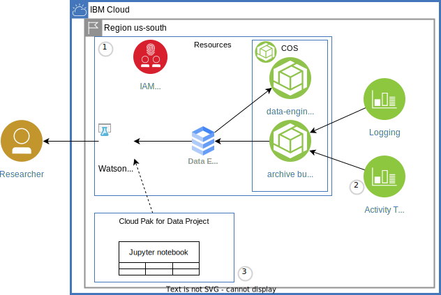

# Historical analysis of Cloud Observability data
This is a companion repository for the [blog post](https://www.ibm.com/cloud/blog/historical-analysis-of-cloud-observability-data) which explains in more details the architecture and steps to provision and analyze data.

Architecture:




# Step 1: Creating the resources
See creating resources directly with terraform below as an alternative to using the IBM Schematics service.

## Create resources using schematics

1. Log in to [IBM Cloud](https://cloud.ibm.com/)
1. Navigate to [Create Schematics Workspaces](https://cloud.ibm.com/schematics/workspaces/create) Under the **Specify Template** section, verify:
   1. **Repository URL** is `https://github.com/IBM-Cloud/log-archive-analysis`
   1. **Terriform version** is **terraform_v1.1**
   1. Click **Next**
2. Under **Workspace details**,
   1. Provide a workspace name : **log-archive**.
   2. Choose a `Resource Group` and a `Location`.  Remember the resource group for the next step.
   3. Click on **Next**.
3. Verify the details and then click on **Create**.
4. Under **Variables** change the **resource-group-name** and the other defaults as desired. 
7. Scroll to the top of the page and click **Apply plan**. Check the logs to see the status of the services created.

## Get schematics output

Use the [IBM Cloud Shell](https://cloud.ibm.com/shell) to run the following commands.  Alternatively you will find instructions to download and install ibmcloud and jq for your operating environment in the [Getting started with tutorials](https://cloud.ibm.com/docs/solution-tutorials?topic=solution-tutorials-tutorials) guide.

The configuration variables retrieved below will be used in future steps.

1. Get the list of workspaces, note the ID column, set the shell variable:
   ```sh
   ibmcloud schematics workspace list
   ```
1. Set the WORKSPACE_ID variable:

   ```sh
   WORKSPACE_ID=YOUR_WORKSPACE_ID
   ```
1. Get the configuration for the logging dashboard settings for archiving.  Used in step 2.
   ```sh
   ibmcloud schematics output --id $WORKSPACE_ID --output json | jq -r '.[0].output_values[].logging_dashboard_settings_archiving.value'
   ```
1. Get the configuration for the jupyter notebook configuration for python. Used in step 3.
   ```sh
   ibmcloud schematics output --id $WORKSPACE_ID --output json | jq -r '.[0].output_values[].jupyter_notebook_configuration_python.value'
   ```

# Step 2: Enable Archiving

- Open the Activity Tracker instance list.
- Create an Activity Tracker in the same region as your resources from the previous step (if one does not exist).
- Open the dashboard of the Activity Tracker.
- Click the Settings cog, click Archiving and then click Manage.
- Click Enable Archiving.
- Select IBM Cloud Object Storage in the Provider drop-down menu.
- Fill in the values with the items generated in Step 1.
- Click Save

Wait until archives are visible in bucket - can take 24 hours.

# Step 3: Jupyter Notebook

- Open the Watson Studio resource - start in the [resource list](https://cloud.ibm.com/resources).
- Click Launch in IBM Cloud Pak for Data.
- If a pop-up screen/overlay page is displayed, dismiss it. It is not needed for this post.
- Click the + in the Project section to create a new project. Click Create an empty project.
- Provide a name. In the Select storage service section, select log-archive-cos from the drop-down menu and click Create.
- In the project, create a Jupyter notebook
- Click the Assets panel at the top.
- Click New asset.
- Type "jupyter" in the search, which should display a Jupyter notebook editor card. Click the card.
- Name the notebook and click the From URL panel at the top.
- Leave the default runtime (IBM Runtime 22.1 on Python 3.9 XS 2vCPU 8 GB RAM for me) and paste this string for the Notebook URL: https://github.com/IBM-Cloud/log-archive-analysis/blob/master/logarchive.ipynb. Then, click Create.


# Clean up

1. Navigate to [Schematics Workspaces](https://cloud.ibm.com/schematics/workspaces).
1. Click your workspace to open.
1. Click **Actions > Destroy resources** and follow instructions.
1. Wait for successful complete.  If it fails try again.
1. Click **Actions > Delete workspace** and follow instructions.


# Troubleshooting

Jupyter notebook query fails with `Unable to infer schema for JSON. It must be specified manually.`
Maybe the COS bucket used for log archiving is empty
- Is the logging or activity tracker dashboard configured to archive?
- Are the variables correct including the crn that ends in ::

# Step 1: Creating resources directly with Terraform alternative

This is an alternative to using the IBM Schematics Service.

See [CLI Getting Started](https://cloud.ibm.com/docs/cli?topic=cli-getting-started).

Initialize and run terraform:

```
cp template.local.env local.env
edit local.env; # make changes as needed
source local.env
terraform init
terraform apply
terraform output logging_dashboard_settings_archiving
terraform output jupyter_notebook_configuration_python
```